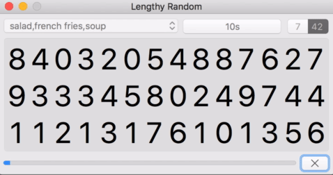
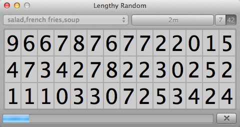
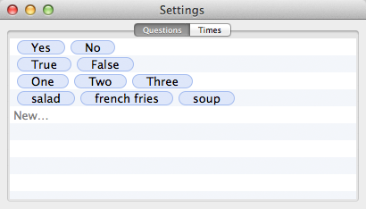
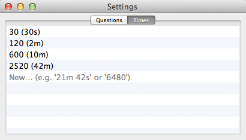

# Lengthy Random

Ever felt like random number generators are too fast? 
Take `Lengthy Random`, ask a question and gaze into the – oddly satisfying – slow number generator.

### The random part

The answer is calculated by summing up all numbers seen on the end screen modulo the number of possible outcomes.
Each cell has a random update interval.
On every update the cell generates a random value.
Additionally, the user chosen time is adjusted by a small random fraction (thats the reason why the time is included on the popup message).

Finally, if you feel the need to increase randomness you can manually freeze individual cells. Or, stop the process early and still get a perfectly valid, random result.

Here are some screenshots for the old macOS 10.5 App:



